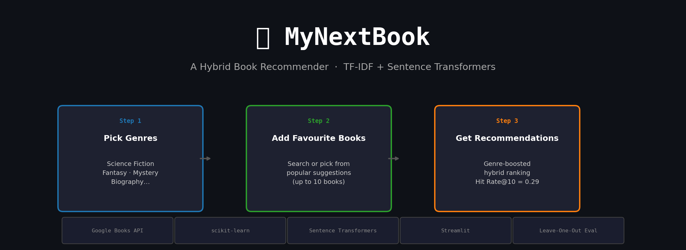
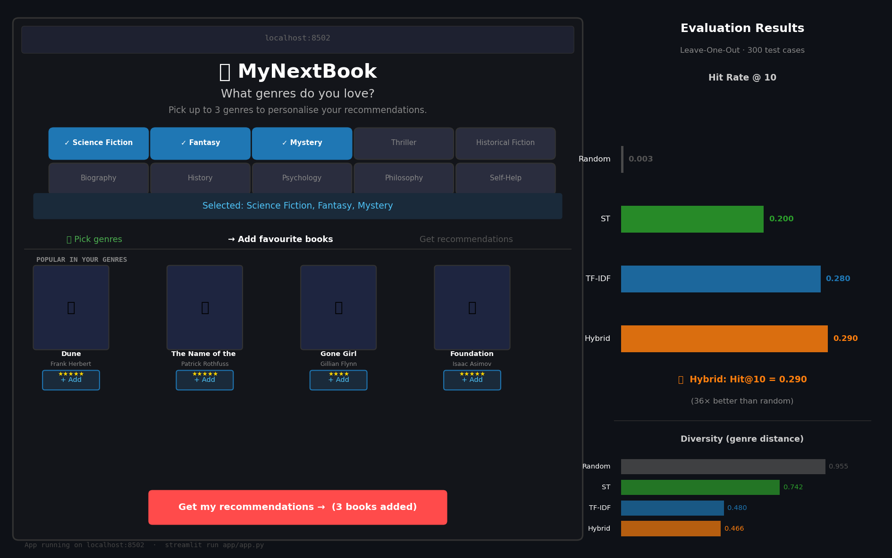

# MyNextBook — Hybrid Book Recommender

A content-based book recommendation system that combines **TF-IDF keyword matching** and **Sentence Transformer neural embeddings** to find books you'll love. Built end-to-end: data pipeline → cleaning → EDA → modelling → offline evaluation → Streamlit app.



---

## Demo



**3-step onboarding:**
1. Pick your favourite genres (up to 3)
2. Add books you've loved (search or choose from popular suggestions)
3. Get personalised recommendations with genre-boosted hybrid ranking

```bash
streamlit run app/app.py
```

---

## Results

Evaluated with **Leave-One-Out** across 300 test cases (hide one book, recommend from the rest, check if it's recovered in the top-10):

| Model | Hit Rate @ 10 | NDCG @ 10 | Diversity |
|---|---|---|---|
| Random baseline | 0.003 | 0.001 | 0.955 |
| TF-IDF | 0.280 | 0.135 | 0.480 |
| Sentence Transformer | 0.200 | 0.109 | 0.742 |
| **Hybrid (best)** | **0.290** | **0.141** | 0.466 |

**Key insight:** TF-IDF outperforms Sentence Transformers alone on this dataset because book descriptions are long and specific — exact keyword matching is hard to beat. The Hybrid wins on accuracy while Sentence Transformers add semantic breadth (higher diversity). The random baseline confirms all models are genuinely learning signal.

---

## Architecture

```
Google Books API
      │
      ▼
 src/pipeline.py          ← 95 search queries × 3 pages × 40 results
      │                      = ~1,300 unique books saved to data/raw/books.csv
      ▼
 src/cleaning.py          ← HTML stripping, language filter, dedup editions,
      │                      stub descriptions, category normalisation
      ▼
 src/models.py
  ├── TFIDFRecommender         TF-IDF (title + authors + categories + description)
  │                            → cosine similarity
  ├── SentenceTransformerRecommender   all-MiniLM-L6-v2 dense embeddings
  │                            → cosine similarity in semantic space
  └── HybridRecommender        min-max normalise both → weighted blend (α=0.6 ST)
      │
      ▼
 src/evaluation.py        ← Leave-one-out on category groups
      │                      Hit Rate@k, NDCG@k, Diversity
      ▼
 app/app.py               ← Streamlit UI
```

---

## Project Structure

```
MyNextBook/
├── app/
│   └── app.py                  Streamlit web app
├── src/
│   ├── pipeline.py             Data collection (Google Books API)
│   ├── cleaning.py             Data cleaning pipeline
│   ├── data_loader.py          Load CSV → clean book dicts
│   ├── models.py               All recommender models
│   ├── evaluation.py           Leave-one-out evaluation
│   └── google_books.py         API client
├── notebooks/
│   ├── 01_eda.ipynb            EDA notebook
│   ├── generate_eda.py         Regenerate EDA plots
│   └── run_evaluation.py       Run model comparison
├── data/
│   └── raw/books.csv           Collected book catalogue
├── .env.example                API key template
└── requirements.txt
```

---

## How to Run

**1. Clone and set up environment**
```bash
git clone <repo-url>
cd MyNextBook
conda create -n mynextbook python=3.10
conda activate mynextbook
pip install -r requirements.txt
```

**2. Add your Google Books API key**
```bash
cp .env.example .env
# Edit .env and paste your key
```

**3. Collect data**
```bash
python -m src.pipeline --max-pages 3    # ~1,300 books, ~8 min
python -m src.pipeline                  # ~15,000 books, ~30 min (full run)
```

**4. Run the app**
```bash
streamlit run app/app.py
```

**5. Run evaluation**
```bash
python notebooks/run_evaluation.py
```

**6. Explore the notebook**
```bash
jupyter notebook notebooks/01_eda.ipynb
```

---

## Tech Stack

| Purpose | Library |
|---|---|
| Data collection | Google Books API, `requests` |
| Data processing | `pandas`, `numpy` |
| TF-IDF model | `scikit-learn` |
| Neural embeddings | `sentence-transformers` (all-MiniLM-L6-v2) |
| Evaluation | Custom leave-one-out (`numpy`) |
| EDA & plots | `matplotlib`, `seaborn` |
| Web app | `streamlit` |

---

## Data Cleaning Steps

Raw Google Books data has several quality issues — all handled in `src/cleaning.py`:

1. **HTML stripping** — descriptions often contain `<b>`, `<br>` tags
2. **Language filter** — `langRestrict=en` isn't perfectly enforced; non-Latin books removed
3. **Stub descriptions** — descriptions < 80 chars are uninformative noise
4. **Rating validation** — ratings outside 1.0–5.0 are nulled
5. **Page count outliers** — < 10 or > 6,000 pages are data errors
6. **Category normalisation** — `"Juvenile Fiction / Fantasy & Magic"` → `"Fantasy"`
7. **Publication year extraction** — parse any date format into a clean int year
8. **Edition deduplication** — same title + author, different volume IDs → keep one

Result: **1,342 raw → 1,203 clean books** (10% removed).
